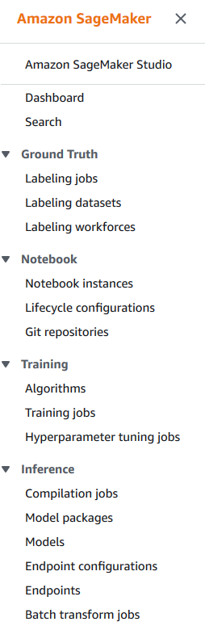

+++
title = "Creating a notebook instance"
chapter = false
weight = 100
+++

## Accessing Amazon SageMaker

1. Navigate to the login link you were provided (or https://console.aws.amazon.com/)

2. Enter your account, username and password and click on "Sign in"
3. At the console, click on the "Find Services" search box and start typing "SageMaker". When you identify it on the drop-down box, click on it.
		

## The SageMaker Console

### AWS Region

Some services are not available in all AWS Regions at this time, thus creating the workshop resources in another region might cause issues.
For this workshop, we'll use **us-east-1, North Virginia**, and you should create all of the resources for this workshop there!

Make sure you select your region from the dropdown in the upper right corner of the AWS Console before getting started.

### The Console and Dashboard

1. On the left side of the initial SageMaker Console you can see the SageMaker menu. Click on "Dashboard".

2. From the Amazon SageMaker dashboard, select Notebook instances.
		

### Creating your First Notebook Instance

3. On the Create notebook instance page, enter a name in the Notebook instance name field. This tutorial uses MySageMakerInstance as the instance name, but you can choose a different name, if desired.
		
	- For this session, choose a Notebook instance type of **ml.m5.2xlarge** (the picture shows the default ml.t2.medium).
	- To enable the notebook instance to access and securely upload data to Amazon S3, an IAM role must be specified. In the IAM role field, choose Create a new role to have Amazon SageMaker create a role with the required permissions and assign it to your instance. Alternately, you can choose an existing IAM role in your account for this purpose.
4. In the Create an IAM role box, select "Any S3 bucket", then choose "Create role".
	
5. Notice that Amazon SageMaker created a role called _AmazonSageMaker-ExecutionRole-\*\*\*_ for you.
	

	For this tutorial, we will use the default values for the other fields. Click on "Create notebook instance".
6. On the Notebook instances page, you should see your new MySageMakerInstance notebook instance in Pending status.
	
	Your notebook instance should transition from Pending to InService status in less than two minutes.