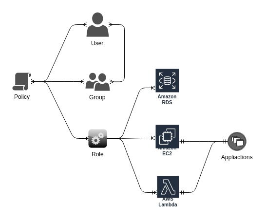

+++
title = "Introduction to IAM"
chapter = false
weight = 400
+++

IAM is the Identity and Access Management service for the AWS Platform, and is a very powerful way of expressing and attaching permissions to entities on the AWS platform.

The first rule of IAM is never use your root user account for daily tasks. 
Make an administrator user when you create the AWS account, enable 2FA on your root account (and every other account) and use your administrator account going forward when you need to add new users etc. and user accounts with lower privileges for day to day tasks.

The service is made up of 4 core concepts

- Policies. A policy is an object in AWS that, when associated with an identity or resource, defines their permissions. IAM policies define permissions for an action regardless of the method that you use to perform the operation, and are expressed with JSON. To see some exaple policies, please refer to [this page](https://docs.aws.amazon.com/IAM/latest/UserGuide/access_policies_examples.html).

- Users. The basic component of Identity based access.

- Groups. A collection of Users, sharing the same set of policies.

- Roles. An IAM role is an IAM entity that defines a set of permissions for making AWS service requests. IAM roles are not associated with a specific user or group. Instead, trusted entities assume roles, such as IAM users, applications, or AWS services such as EC2.


Policies come in 3 flavours, 

- AWS managed policies, created and managed by AWS, with new services automatically on-boarded to them.
- Customer managed policies, that you create and manage in your AWS account, and attach where desired.
- Inline policies that are embedded directly into a single user, group, or role. In most cases, we don't recommend using inline policies.

There are also more advanced features, like cross account access, temporary credentials, permission boundaries, conditions etc.

To dive deeper into these areas, please refer to [the documentation](https://docs.aws.amazon.com/IAM/latest/UserGuide/access.html).

### To summarise the relationship, please refer this diagram



### ARN's

Policy documents apply to a Resource, via something called an ARN, an Amazon Resource Name.
The resource can be something that you have created in your account, such as a User, or an Auto Scaling Group, or a service endpoint provided by AWS, and the Actions define read or write operations you are allowed to make on that resource.

The following is an example policy that you will create later.

    ```json
    {
    "Version": "2012-10-17",
    "Statement": [
        {
        "Sid": "workshopPerm1",
        "Effect": "Allow",
        "Action": ["personalize:*", "s3:*", "lex:*"],
        "Resource": "*"
        },
        {
        "Sid": "workshopPerm2",
        "Effect": "Allow",
        "Action": [
            "iam:GetRole",
            "iam:PassRole",
            "iam:CreateRole",
            "iam:AttachRolePolicy"
        ],
        "Resource": "arn:aws:iam::*:role/*"
        }
    ]
    }
    ```

In this example, anyone with the policy attached is allowed to take all possible actions, designated by the *, on Amazon S3, Lex and Personalize. 
Also, anything running under a Role is allowed to call the GetRole, PassRole, CreateRole and AttachRolePolicy operations on the IAM service itself.
    
The following ARNs explain the general naming format

- arn:partition:service:region:account-id:resource
- arn:partition:service:region:account-id:resourcetype/resource
- arn:partition:service:region:account-id:resourcetype:resource


Now go to [Kick-off Object Detection training]()
